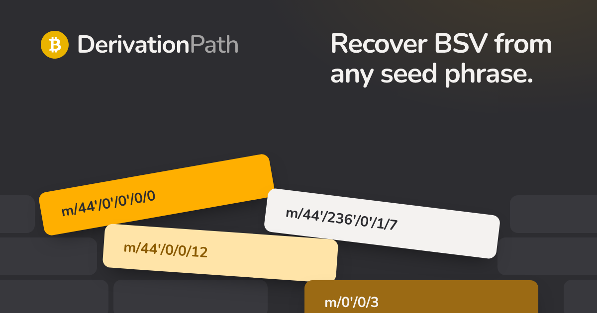

# Derivation Path



**Recover BSV from any seed phrase.** Derivation Path finds every address a wallet ever used, shows what's still on them, and moves those coins into a [BRC-100](https://brc.dev/100) wallet (like Metanet Desktop) or to any BSV address. It runs entirely in your browser.

It's built for wallets that no longer work or no longer exist, such as Centbee, RockWallet, MoneyButton and Twetch, where the coins are still on the blockchain but the app to spend them is gone.

> [!WARNING]
> Use at your own risk. This software is provided **as is**, without warranty, and the authors accept no liability for any loss. Read the [Terms of Use](TERMS.md) before using it.

## Contents

- [Why a derivation path matters](#why-a-derivation-path-matters)
- [Features](#features)
- [Run it locally](#run-it-locally)
- [How to recover your coins](#how-to-recover-your-coins)
- [Supported wallets](#supported-wallets)
- [Security and privacy](#security-and-privacy)
- [Development](#development)
- [Terms of Use and disclaimer](#terms-of-use-and-disclaimer)
- [License](#license)

## Why a derivation path matters

A seed phrase doesn't hold coins directly. Each wallet app follows its own recipe, a **derivation path** such as `m/44'/0'/0'/0/0`, to turn the phrase into a list of addresses. The same phrase gives completely different addresses under different paths, so an app that uses the wrong path shows an empty wallet even when the coins are there. Derivation Path knows the recipes of common BSV wallets and can try all of them.

## Features

| | |
| --- | --- |
| **Wallet** | Load a 12 to 24 word BIP39 phrase, with an optional PIN or passphrase, or generate a new one. Pick the wallet app it came from or type any path. |
| **Recover** | Walk receive and change addresses until a run of unused ones (the gap limit), on one path or every known wallet at once. Move what it finds into a BRC-100 wallet or to any address. |
| **Send** | Pay from the selected address, or send everything on it. You review the transaction before it goes out. |
| **Tokens** | See 1Sat ordinals (NFTs) and BSV-20 tokens at an address. They are never spent by accident. |
| **History** | List past transactions across your addresses. |
| **Backup** | Save your phrase encrypted with a password (AES-GCM, PBKDF2-SHA256 with 310,000 iterations), in the browser or as a file. |
| **Settings** | Choose the blockchain data source, the transaction link and the network fee. |

The interface works on phones (bottom tab bar), has a light and dark theme, and explains every field in plain language.

## Run it locally

Running it on your own computer is the safest way to use it: you don't have to trust anyone hosting a copy. You need [Node.js](https://nodejs.org) 20 or later.

```bash
git clone https://github.com/vincemedia/derivationpath.git
cd derivationpath
npm install
npm run dev
```

Then open http://localhost:5173.

To serve a production build instead:

```bash
npm run build
npm run preview    # http://localhost:4173
```

## How to recover your coins

1. **Wallet tab:** choose the wallet app that created the phrase, type the phrase and its PIN or passphrase (leave it empty if you never set one), then press **Load wallet**.
2. **Recover tab:** press **Scan for coins**. Not sure which app you used? Pick **Every wallet we know** under "Paths to scan".
3. **Review:** the table lists every address with coins. Untick any you want to leave.
4. **Move the coins:**
   - **BRC-100 wallet:** open Metanet Desktop first, then press **Move to my wallet**. Your wallet chooses where the coins land and pays the fee; each input is signed in your browser, so the wallet can't change where the money goes.
   - **Any BSV address:** paste the address, press **Prepare transaction**, check the amounts, then press **Send now**.
5. A link to the transaction appears. The results are cleared so the same coins can't be moved twice.

Found nothing? Try **Every wallet we know**, raise the gap limit, or check your old wallet's documentation for its path and type it in.

## Supported wallets

A path template uses `{index}` for the address number and, optionally, `{chain}` for the list (0 = receive, 1 = change). `'` marks a hardened step.

| Wallet | Path template |
| --- | --- |
| Centbee | `m/44'/0/0/{index}` |
| RockWallet | `m/0'/0/{index}` |
| BIP44 default, MoneyButton, Twetch | `m/44'/0'/0'/{chain}/{index}` |
| ElectrumSV, Exodus, RelayX, Keevo | `m/44'/236'/0'/{chain}/{index}` |
| Atomic, SimplyCash | `m/44'/145'/0'/{chain}/{index}` |
| BIP32 basic | `m/0'/{chain}'/{index}'` |
| Legacy prefixes from earlier versions of this tool | `m/44'/236'/0'/{index}`, `m/44'/0'/0'/{index}` |

Any other BIP32 path can be typed in as a custom template.

## Security and privacy

**Your keys stay in your browser.** The seed phrase, passphrase and private keys are never sent to any server and never saved unencrypted. Only public data leaves the page: addresses and signed transactions go to [WhatsOnChain](https://whatsonchain.com) for balances, history and broadcasting, and addresses go to [GorillaPool](https://ordinals.gorillapool.io) for the NFT and token check.

**Safety rails built in:**

- **NFTs and tokens are protected.** Before any spend, every coin is checked against GorillaPool's 1Sat indexer, including BSV-20 outputs, which the indexer only returns on request, and every page of results. Flagged coins and every 1-sat coin are left alone. If the check can't run, nothing is sent.
- **Coins are verified before signing.** Each input's source transaction is fetched and must be a plain payment of the expected amount to your address, so an inscription or a wrong amount from the API is refused.
- **Scans fail loudly.** Requests are rate-limited and retried; a scan that can't reach the network stops with an error instead of showing a partial result as complete.
- **Fees are sanity-checked**, and every irreversible action asks for confirmation.
- **Auto-lock.** Keys are wiped after 10 minutes without activity or 60 seconds in a background tab. With a saved backup you unlock with its password.

Only enter a seed phrase on a device you trust, and consider moving recovered coins to a fresh wallet afterwards.

## Development

Built with React 19, TypeScript and Vite, on [`@bsv/sdk`](https://github.com/bsv-blockchain/ts-sdk).

```bash
npm run dev         # dev server on :5173
npm run build       # typecheck + production build
npm run lint
npm test            # vitest unit tests + signing scripts
npm run terms:md    # regenerate TERMS.md after editing src/terms.ts
```

| Folder | What's in it |
| --- | --- |
| `src/lib` | UI-free logic: derivation and presets, network clients, NFT/token protection, scanning, transaction building, the BRC-100 sweep and the encrypted vault |
| `src/components` | The panels and shared UI (popover selects, tooltips, explainers, tab bar) |
| `src/hooks` | Auto-lock, theme and task/status helpers |
| `public/wallets` | Wallet icons, bundled so nothing loads from third-party sites |

Unit tests cover the BIP44 test vectors, path parsing, NFT/token filtering, the vault and transaction building against a mocked API. [CLAUDE.md](CLAUDE.md) has architecture notes and the rules every spend must follow. The `SECURITY_*.md` files are a review of the original version of this tool and predate the current code.

## Terms of Use and disclaimer

By using Derivation Path you agree to the [Terms of Use](TERMS.md), which are also shown in the app (footer link, or `#terms`). They cover the no-warranty and no-liability terms, your responsibilities, a waiver of class and collective actions, and Dutch law as the governing law.

THIS SOFTWARE IS PROVIDED "AS IS", WITHOUT WARRANTY OF ANY KIND, EXPRESS OR IMPLIED, INCLUDING BUT NOT LIMITED TO THE WARRANTIES OF MERCHANTABILITY, FITNESS FOR A PARTICULAR PURPOSE, ACCURACY AND NON-INFRINGEMENT. YOU USE IT ENTIRELY AT YOUR OWN RISK. TO THE FULLEST EXTENT PERMITTED BY LAW, IN NO EVENT SHALL THE AUTHORS, CONTRIBUTORS, COPYRIGHT HOLDERS OR ANYONE HOSTING THIS SOFTWARE BE LIABLE FOR ANY CLAIM, LOSS OF FUNDS OR DIGITAL ASSETS, LOSS OF DATA, OR ANY DIRECT, INDIRECT, INCIDENTAL, SPECIAL, CONSEQUENTIAL OR OTHER DAMAGES, WHETHER IN AN ACTION OF CONTRACT, TORT (INCLUDING NEGLIGENCE) OR OTHERWISE, ARISING FROM, OUT OF OR IN CONNECTION WITH THE SOFTWARE OR ITS USE, EVEN IF ADVISED OF THE POSSIBILITY OF SUCH DAMAGES. NOTHING HERE IS FINANCIAL, LEGAL OR TAX ADVICE. BLOCKCHAIN TRANSACTIONS ARE IRREVERSIBLE, AND NO ONE CAN RECOVER FUNDS SENT TO THE WRONG ADDRESS OR A LOST SEED PHRASE, PASSPHRASE OR PASSWORD.

## License

[Apache License 2.0](LICENSE.txt).
